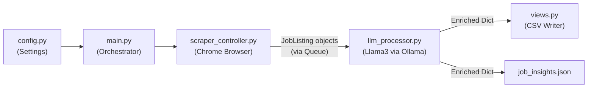
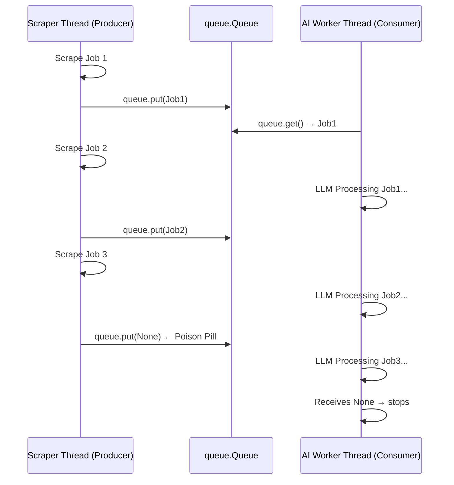

# LinkedIn Job Scraper — Comprehensive Technical Explanation

## 🏗️ Overall Architecture

The project is structured as a clean, layered pipeline:

```
config.py       → Central settings (search query, job limits, Ollama URL, etc.)
models.py       → Data class (the "shape" of a scraped job)
scraper_controller.py  → Browser automation (Selenium)
llm_processor.py       → AI analysis (Ollama/Llama3)
main.py         → Orchestrator (parallel threads, queue management)
views.py        → Output formatting (CSV writer)
```

The data flow looks like this:



---

## Part 1: `scraper_controller.py` — The Selenium Engine

### What is Selenium?
Selenium is a **browser automation framework**. It communicates with Chrome via a protocol called **WebDriver**, which allows Python to send commands like:
- "Navigate to this URL"
- "Find this element on the page"
- "Click this button"
- "Read the text of this element"

It is the only way to reliably scrape JavaScript-heavy sites like LinkedIn, because LinkedIn's job listings are **not in the initial HTML** — they are rendered by JavaScript *after* the page loads.

---

### `__init__` & State

```python
class LinkedInScraper:
    def __init__(self):
        self.driver = None   # The Chrome WebDriver instance
        self.wait = None     # A smart waiter (WebDriverWait)
        self.current_category = ""  # Tracks which search query is active
```

`self.driver` is the most important object. Every interaction with Chrome flows through it.

---

### `setup_driver()` — Starting the Browser

```python
chrome_options = Options()
chrome_options.add_argument("--user-data-dir=...")   # Use a saved Chrome profile
chrome_options.add_argument("--disable-blink-features=AutomationControlled")
self.driver = webdriver.Chrome(options=chrome_options)
self.wait = WebDriverWait(self.driver, config.PAGE_LOAD_WAIT)
```

**Key decisions here:**
| Flag | Why it's needed |
|---|---|
| `--user-data-dir` | Points Chrome to your saved session, so you're already logged in |
| `--disable-blink-features=AutomationControlled` | Hides the bot fingerprint from LinkedIn's bot detection |
| `--no-sandbox` / `--disable-gpu` | Stability flags essential on Windows |
| `WebDriverWait` | Creates a "smart waiter" that polls for elements up to `PAGE_LOAD_WAIT` seconds, instead of using a fixed `time.sleep()` |

---

### `wait_for_login()` — Smart Login Detection

```python
self.driver.get("https://www.linkedin.com/feed")
self.wait.until(EC.presence_of_element_located((By.ID, "global-nav-search")))
```

This uses **Expected Conditions (EC)**. Instead of sleeping for a fixed time, `EC.presence_of_element_located` tells Selenium: *"Keep polling the DOM every 500ms. Return when the element with `id="global-nav-search"` appears, or raise a TimeoutException after N seconds."*

If the search bar appears → you're logged in. If not → it falls into a manual login loop.

---

### `search_jobs()` — The "Power URL" Technique

```python
search_url = f"https://www.linkedin.com/jobs/search/?keywords={encoded_query}&f_TPR=r86400"
```

Rather than programmatically typing in the search box (which is fragile), the scraper constructs a **direct LinkedIn URL** with built-in filters:
- `f_TPR=r86400` → "Posted in the last 24 hours" (`r86400` = 86400 seconds = 1 day)
- `f_E=1,2,3` → Experience level filter

After navigating, it waits for the results container to load:

```python
self.wait.until(EC.presence_of_element_located((By.CSS_SELECTOR, ".jobs-search-results-list")))
```

---

### `extract_job_list()` — The Main Scraping Loop

This is the most complex method. It has two phases:

#### Phase 1: Trigger Lazy Loading (Scrolling)
```python
self.driver.execute_script("arguments[0].scrollTop = arguments[0].scrollHeight", scrollable_div)
```
LinkedIn uses **virtual scrolling** — it only renders job cards that are visible in the viewport. This JavaScript command scrolls the left sidebar container to its bottom, forcing LinkedIn to render all the cards. It does this **4 times** to load enough cards.

#### Phase 2: The Persistent Quota Loop
```python
processed_id_set = set()
current_index = 0
while len(jobs) < max_jobs:
    current_cards = self.driver.find_elements(By.XPATH, selector)  # Refetch every iteration
    card = current_cards[current_index]
    current_index += 1
    ...
    job_hash = f"{job_data.title.lower()}::{job_data.company.lower()}"
    if job_hash not in processed_id_set:
        jobs.append(job_data)
        job_queue.put(job_data)  # ← Push to AI worker immediately
```

**Why refetch cards every iteration?** LinkedIn's DOM can change as you scroll — cards may be added or removed. Re-fetching `current_cards` inside the loop ensures you always have a fresh handle to the live DOM.

**Why a `while` loop instead of `for`?** LinkedIn repeats job cards. A `for` loop with a fixed range would stop early if it hit too many duplicates. The `while` loop keeps going until the **quota** (`max_jobs`) of **unique** jobs is filled.

**The `job_queue.put()`** is the parallel pipeline handoff — the scraped job is instantly sent to the background AI thread *without waiting for the next job to be scraped*.

---

### `extract_job_details()` — Reading the Right Panel

After clicking a job card, LinkedIn loads details in a **right-side panel**. This method reads it.

#### Step 1: Find the Container
```python
container_selectors = [".jobs-search-two-pane__details", ".scaffold-layout__detail", ...]
for sel in container_selectors:
    el = self.driver.find_element(By.CSS_SELECTOR, sel)
```
Multiple selectors are tried because LinkedIn's CSS class names **change frequently** between A/B test versions of their UI.

#### Step 2: Wait for Stability
```python
self.wait.until(lambda d: d.find_element(By.CSS_SELECTOR, "h1, h2, .job-title").text.strip() != "")
```
A **lambda wait**: keep polling until the title element has non-empty text. This is better than `time.sleep()` because it returns the moment the content is ready.

#### Step 3: Selector Fallback Chain (Title, Company, Description)
Every field uses the same pattern:
```python
for by, sel in title_selectors:
    try:
        text = detail_container.find_element(by, sel).text.strip()
        if text:
            job.title = text
            break  # ← Stop at the first one that works
    except: continue
```
This "waterfall" pattern tries the most reliable selector first and falls back gracefully. `.text` on a Selenium element returns the **rendered text content** of that DOM node — exactly what you'd see on screen.

#### Step 4: Time Parsing
```python
time_xpath = ".//*[contains(translate(text(), 'ABCDE...', 'abcde...'), 'ago')]"
time_els = detail_container.find_elements(By.XPATH, time_xpath)
```
XPath with `translate()` performs a **case-insensitive search** across all child elements for any element whose text contains "ago". Once the raw string (e.g. "17 hours ago") is found, `_calculate_absolute_time()` converts it to an absolute timestamp using `datetime` and `timedelta`.

#### Step 5: Apply Link Extraction
```python
current_url = self.driver.current_url
job_id_match = re.search(r"currentJobId=(\d+)", current_url)
if job_id_match:
    job.apply_link = f"https://www.linkedin.com/jobs/view/{job_id}/"
```
The LinkedIn Job ID is parsed from the **browser's current URL** using a regular expression. This produces a clean, canonical link regardless of what query parameters are in the URL.

---

## Part 2: `llm_processor.py` — The Llama3 Intelligence Layer

### How the Connection Works (No SDK Required)

This is arguably the most elegant part of the architecture. There is **no special Llama3 library** used. The `OllamaProcessor` class communicates with your locally running Ollama process via a standard **HTTP REST API**, using Python's `requests` library.

```
Python Script ──(HTTP POST)──► Ollama Server (localhost:11434) ──► Llama3 Model (in VRAM/RAM)
                                                                         │
Python Script ◄──(HTTP Response, JSON)────────────────────────────────────┘
```

Ollama acts as a lightweight HTTP server that manages loading/unloading the model and queuing requests.

---

### `__init__` — Initialization

```python
class OllamaProcessor:
    def __init__(self):
        self.system_prompt = self._load_system_prompt()
```

Initialization is **almost free** — it just builds the system prompt string in memory. The model itself is NOT loaded at this point. Llama3 only loads into GPU/RAM when the first actual request is sent to Ollama.

---

### `_load_system_prompt()` — The AI's Instruction Manual

This is the most important part of the LLM integration. The system prompt is a carefully engineered instruction that tells Llama3:
1. **Its role**: `"You are a strict information extraction system."`
2. **Its output format**: A precise JSON schema it must follow.
3. **Its rules**: 7 specific rules for how to classify skills, parse experience ranges, detect work models, etc.

```python
return """
You are a strict information extraction system.
Extract structured data from the job description and return ONLY valid JSON.

Output Schema:
{
  "skills": {
    "primary_skills": [],
    "secondary_skills": [],
    "soft_skills": [],
    "coding_skills": { "type": "any_one | all_required", "languages": [] }
  },
  "experience": { "description": "string", "range": [min, max] },
  "responsibilities": [],
  "apply_link": "string",
  "location_insights": { "city": "...", "country": "...", "work_model": "Remote | Hybrid | On-site" }
}
"""
```

The **JSON schema** acts as a contract. By showing the model an example of the exact structure you want, it learns to fill in the values rather than generating free-form text. This is called **few-shot / schema-guided prompting**.

---

### `process_description()` — Sending the Request

```python
def process_description(self, description):
    full_prompt = f"{self.system_prompt}\n\nJob Description:\n{description}\n"
    
    payload = {
        "model": "llama3",
        "prompt": full_prompt,
        "stream": False,
        "format": "json"   # ← Critical: forces Ollama to guarantee valid JSON output
    }
    
    response = requests.post("http://localhost:11434/api/generate", json=payload, timeout=300)
    result = response.json()
    raw_text = result.get("response", "")
    return self._parse_json(raw_text)
```

**Key parameters explained:**

| Parameter | Value | Purpose |
|---|---|---|
| `model` | `"llama3"` | Specifies which model Ollama should use |
| `prompt` | System prompt + job content | The full input to the model |
| `stream` | `False` | Wait for the full response before returning (vs. streaming tokens one-by-one) |
| `format` | `"json"` | Ollama's **JSON mode**: it forces the model's output to be syntactically valid JSON at the token-generation level |
| `timeout` | `300` | Wait up to 5 minutes for a response (Llama3 on CPU can be slow) |

The **context sent to the model** is carefully constructed in `main.py`:
```
Role: Data Engineer
Company: Barclays
Scraped Location: Bengaluru
Apply Link: https://www.linkedin.com/jobs/view/...

Job Description:
[Full text of the job post...]
```

Providing `Role`, `Company`, and `Scraped Location` as hints before the description helps the model ground its location and skills analysis.

---

### `_parse_json()` — Defensive Parsing

```python
def _parse_json(self, text):
    try:
        return json.loads(text)          # Attempt 1: Direct parse
    except json.JSONDecodeError:
        match = re.search(r'(\{.*\})', text, re.DOTALL)  # Attempt 2: Extract JSON block
        if match:
            return json.loads(match.group(1))
    return None
```

Even with `"format": "json"`, the model occasionally wraps its response with extra text. The fallback uses a **regex with `re.DOTALL`** (which makes `.` match newlines too) to find the JSON object `{...}` and extract only that portion.

---

## Part 3: `main.py` — The Parallel Orchestrator

The key innovation is the **Producer-Consumer pattern** using `queue.Queue` and `threading`:



- **`queue.Queue`** is thread-safe by design — no manual locking needed for the queue itself.
- **`threading.Lock` (`data_lock`)** protects the shared `final_data` list when the AI worker appends to it.
- The **"Poison Pill" (`None`)** is a standard pattern for gracefully shutting down worker threads. One `None` is sent per worker thread.

---

## Summary: The Full Data Journey

| Stage | File | What Happens |
|---|---|---|
| 1. Configure | `config.py` | Set search query, job count, Ollama model |
| 2. Boot | `main.py` | Start AI thread(s), then launch Chrome |
| 3. Navigate | `scraper_controller.py` | Build Power URL, trigger lazy load scroll |
| 4. Extract | `scraper_controller.py` | Click cards, read DOM with Selenium selectors |
| 5. Model | `models.py` | Pack data into `JobListing` dataclass, clean whitespace |
| 6. Queue | `main.py` | Push `JobListing` into `queue.Queue` (parallel handoff) |
| 7. Analyze | `llm_processor.py` | Send to Llama3 via Ollama REST API |
| 8. Parse | `llm_processor.py` | Parse JSON response defensively |
| 9. Save | `views.py` / `main.py` | Write to `job_insights.json` and `linkedin_jobs.csv` |
